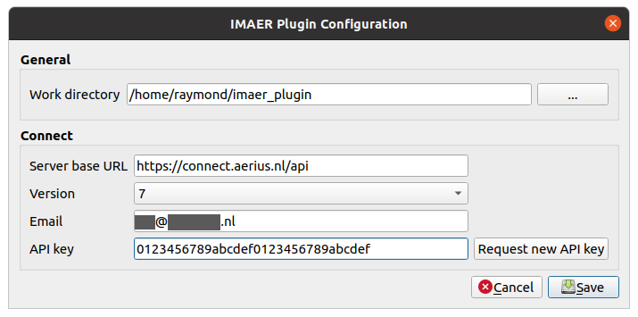

* [Index](index.md)
* [Import Calculator Results](01_import_calc_results.md)
* [Export Calculator Results](02_export_calc_results.md)
* [Extract GML from AERIUS PDF](03_extract_gml_from_pdf.md)
* [Generate Calculator Input](04_generate_calc_input.md)
* [Relate Calculator results](05_relate_calc_results.md)
* [Add Open data Layer](06_open_data_layers.md)
* [Connect - Receptor Sets](07_connect_receptor_sets.md)
* [Connect - Jobs](08_connect_jobs.md)
* [Configuration](09_configuration.md)

# Configuration

Some plugin configurations can be set in the Configuration dialog. Most of them are related to Connect.

## General

### Country:
The country where you are using AERIUS. Different countries use different versions
and sub sets of IMAER.

### CRS:
Coordinate reference system your IMAER data should use.

### Work directory:
This is the default local directory on your system where the plugin will download
and save files to. Make sure you have write access to this directory.

## Connect

These settings are only needed if you want to use the plugin for AERIUS Connect
functionality. When the settings are right, the

### Server base URL:
Location of the Connect API URL. Should by default point to the current production
URL.

Some examples:
* https://connect.aerius.nl/api

### Version:
Connect server version. The version is displayed on the Connect swagger page. Just visit
the Server base URL with your web browser to find it.

### Email:
The email address you want to use for Connect. This is also your account name, and
the address that will receive notifications when your calculations are completed.

### API Key:
Connect API key that you will receive by e-mail after requesting it. You can click
the `Request new API key` button to get (a new) one.

After receiving the new API key in your mailbox, simply copy the 32 character key
to the configuration screen.

## Save
When saving the settings, the plugin will attempt to make a connection by firing
a few rquests. They will also update the content of the connect plugin dialogs.

### Hint

In case you are running into connection problems, open the Debug/Developer panel in QGIS
(F12) to inspect the internet traffic between QGIS and Connect.
