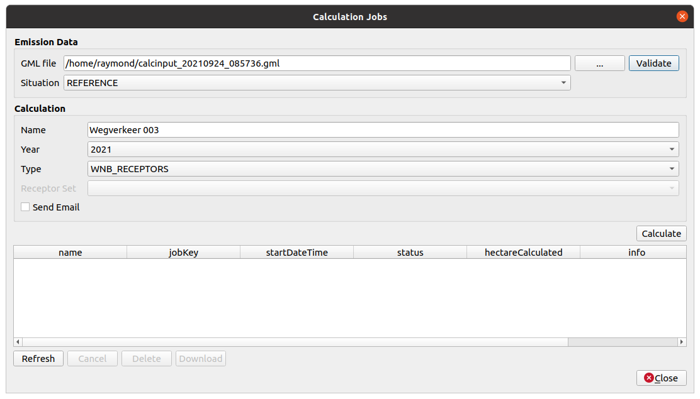

* [Index](index.md)
* [Import Calculator Results](01_import_calc_results.md)
* [Extract GML from AERIUS PDF](03_extract_gml_from_pdf.md)
* [Generate Calculator Input](04_generate_calc_input.md)
* [Relate Calculator results](05_relate_calc_results.md)
* [Connect - Receptor Sets](07_connect_receptor_sets.md)
* [Connect - Jobs](08_connect_jobs.md)
* [Configuration](09_configuration.md)

# Connect - Jobs

In this dialog you can start calculation jobs in Connect. The dialog displays a
an overview of all jobs with statuses.

## Introduction

The main purpose of this sending your emission GML file to the Connect API to
start a calculation. The GML can be either created with the Generate Calculator
Input functionality from this plugin or generated in any other way.

### Validate

After picking the GML file it is recommended to run a validation before starting
a calculation. Just hit the `Validate` button and wait for the result.

The validation result will be shown in a dialog like these:

In case of an error, you can selecting the text (CTRL-A) and copy (CTRL-C) it
to the clipboard.

### Calculate

For starting a calculaion you will need to set some input parameters:

* Situation: DEFINED_BY_FILE, REFERENCE, PROPOSED, TEMPORARY
* Name: Any name for your own reference. This will be displayed in the table
* Type:
  * WNB_RECEPTORS: Normal calculation on all default Nature Area receptors.
  * CUSTOM_POINTS: Pick one of your self uploaded receptor sets
* Send e-mail when calculation is completed: Check if you wish to receive an email notification when the calculation has finished

Click the `Calculate` button for sending your data to Connect and start the calculation.

In case everything is fine, a new row will appear in the jobs table. If not, something
went wrong. Make sure your GML is valid.

### Jobs Table

This table is showing all the jobs on your account that are currently available
on the Connect server.
* name: The name you picked when starting the calculation
* jobKey: The unique ID, set by the server
* startDateTime: Date and time your job has started
* status: Current job status: UNDEFINED, INITIALIZED, RUNNING, COMPLETED, CANCELLED, DELETED or ERROR
* hectareCalculated: Shows the calculated area for the job
* info:
  * COMPLETED: shows a download link to the ZIP with calculation results
  * ERROR: shows the error message

#### Refresh

The table will only be updated after running an action, not regularly at a certain
time interval. This is to prevent the plugin to fire huge amounts of unnecessary
requests to the Connect server.

Simply press `Refresh` to update the table content.

#### Cancel

Cancel an initialized or running job by selecting it in the table and
pressing `Cancel`. Cancelled jobs will still be available on the server.

#### Delete

Delete jobs by selecting one (or multiple) jobs in the table and preessing `Delete`.

#### Download

Completed jobs, showing a download link in the info column, can be downloaded and
added to your QGIS project by clicking `Download`. This is similar to downloading
it manually and using the Import Calculator Result function from this plugin.
