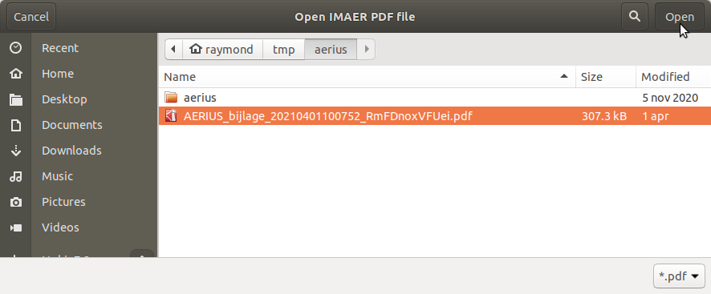

* [Index](00_index.md)
* [Import Calculator Results](01_import_calc_results.md)
* [Export Calculator Results](02_export_calc_results.md)
* [Extract GML from AERIUS PDF](03_extract_gml_from_pdf.md)
* [Generate Calculator Input](04_generate_calc_input.md)
* [Relate Calculator results](05_relate_calc_results.md)

# Extract GML from AERIUS PDF

## Introduction

AERIUS Calculator provides downloading a PDF file which contains emission sources in a data block. This function helps you extracting that data from the PDF and save it to a GML file.

## Howto

1. Click the  button to open the dialog for generating Calculator input GML.
2. Choose the PDF file containing your input data.

After pressing `open`, the plugin will save the extracted data to a GML file with the same file name but `.gml` for the extension. A link to the file will be displayed in the message bar on top of your map. If anything goes wrong, an error will be displayed there.
