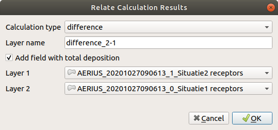

* [Index](00_index.md)
* [Import Calculator Results](01_import_calc_results.md)
* [Export Calculator Results](02_export_calc_results.md)
* [Extract GML from AERIUS PDF](03_extract_gml_from_pdf.md)
* [Generate Calculator Input](04_generate_calc_input.md)
* [Relate Calculator results](05_relate_calc_results.md)

# Relate Calculator results

## Introduction

Relate IMAER layers to one another by calculating the sum or difference of the receptor's deposition values.

## Howto

You will need at least 2 IMAER layers, loaded with the Import IMAER GML tool.

1. Click the  button to open the dialog.
2. Choose the `calculation type` (difference or sum).
3. By default, the name for the new layer will be the calculation type. You can choose a more specific name in the `layer name` input widget.
4. Choose the layers to perform the calculation on. (In case of calculating the difference, is will be layer1 minus layer2)

A new memory layer will be created, holding all receptors from the input layers. In case a receptor only exists in one of the layers, the calculation will use the value 0 for the missing receptor.

The generated memory layer will have a predefined, 2 color style showing positive or negative values. This style can be changed with standard QGIS functionality.

Output layers will have the same deposition fields as the IMAER layers so they can be used with this relate function as well. For example for summarizing more than 2 layers.
